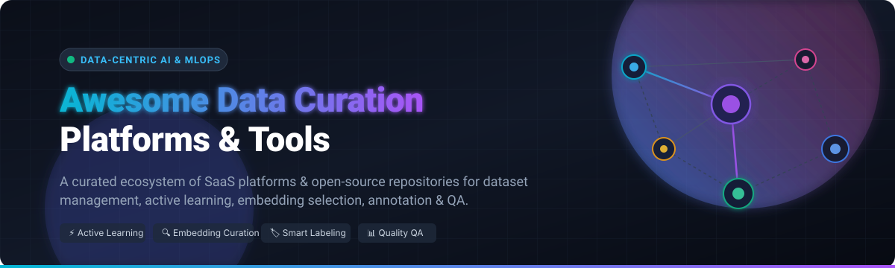

# 🚀 Awesome Data Curation Platforms & Tools

<div align="center">

<a href="https://github.com/ishandutta2007/Awesome-Awesome-Awesome"></a>
<a href="https://discord.gg/jc4xtF58Ve"></a>
<a href="https://github.com/ishandutta2007/Awesome-Data-Curation-Platform/stargazers"></a>
<a href="https://github.com/ishandutta2007/Awesome-Data-Curation-Platform/network/members"></a>
<a href="https://github.com/ishandutta2007/Awesome-Data-Curation-Platform/blob/main/LICENSE"></a>
<a href="https://github.com/ishandutta2007"></a>

<br/><br/>



<br/>

### 🌟 A Comprehensive, Curated Ecosystem of SaaS Platforms & Open-Source Tools for Data-Centric AI

*Dataset Management • Active Learning • Embedding-Based Selection • Annotation Pipelines • Label Quality Assurance • Multimodal Curation*

**Last updated: August 2026**

</div>

---

## 📖 Overview

High-quality training datasets are the single most critical driver of modern machine learning performance. This repository provides a systematically curated index of category-leading **SaaS platforms** and top **open-source GitHub repositories** for **Data Curation**, **Active Learning**, and **Data-Centric AI (DCAI)**. 

Whether you are building LLMs, multimodal vision-language models, autonomous driving perception stacks, or medical imaging pipelines, these tools help AI/ML engineering teams:
- 🎯 **Select the most informative samples** and eliminate redundant data to slash labeling budgets.
- 🔍 **Explore embeddings & semantic clusters** to identify edge cases, out-of-distribution instances, and data drift.
- 🏷️ **Accelerate annotation** with model-assisted labeling, programmatic supervision, and consensus workflows.
- 🧹 **Detect label errors, noise, and outliers** automatically using confident learning and uncertainty estimation.
- 🔄 **Close the feedback loop** between model evaluation and dataset curation.

---

## 📑 Table of Contents

- [☁️ SaaS / Hosted Platforms](#-saashosted-platforms)
- [💻 Open-Source GitHub Projects](#-open-source-github-projects)
- [🏗️ Recommended Open Architecture](#️-recommended-open-architecture)
- [🤝 How to Contribute](#-how-to-contribute)
- [📈 Star History](#-star-history)
- [⚖️ Disclaimer](#️-disclaimer)

---

## ☁️ SaaS / Hosted Platforms

Leading commercial data curation and training-data platforms, sorted in descending order by **Company Scale (Valuation / Revenue / Enterprise Footprint)**:

| Platform | Description | Scale (Valuation / Revenue) | Pricing (Starting Tier) | Free Tier / Trial Limits |
| :--- | :--- | :--- | :--- | :--- |
| **[Scale AI](https://scale.com/)** | Full-stack AI data foundry providing high-volume annotation, dataset curation (*Nucleus*), RLHF, and frontier model evaluations. | **~$29 Billion valuation** (~$2B revenue) | Self-serve annotation tasks start at ~$0.05 per labeling unit after free credits; custom enterprise contracts. | **Free Plan**: *Nucleus Free Tier* for dataset exploration; 200 free labeling units/month for self-serve annotation accounts. |
| **[Snorkel AI](https://snorkel.ai/)** | Programmatic labeling and data development platform (*Snorkel Flow*) powered by weak supervision, foundation models, and custom data labs. | **~$1.3 Billion valuation** (~$148M ARR) | Annual enterprise contracts start at ~$50,000 - $60,000/year (custom scoped per project). | **Free Trial / Access**: No self-serve free plan. Free pilot/evaluation access granted only via sales engagement and demo request. |
| **[Labelbox](https://labelbox.com/)** | Cloud-native data-centric AI platform uniting multimodal annotation, dataset catalog search, model diagnostics, and workforce management. | **~$1.0 Billion valuation** (~$50M - $115M ARR) | Starter plan starts at $0.10 per Labelbox Unit (LBU) consumed; Enterprise custom quotes. | **Free Plan**: 500 Labelbox Units (LBUs)/month, supporting up to 30 users, 50 projects, and 10M total data rows. |
| **[Encord](https://encord.com/)** | Enterprise multimodal data annotation, active curation (*Encord Active*), and model evaluation platform tailored for vision, video, and medical data. | **~$550 Million valuation** (~$13M ARR) | Starter plan custom-quoted per organization (Starter, Team, and Enterprise tiers). | **Free Trial / Access**: Free evaluation access upon demo request and pilot setup (no open self-serve free tier; Encord Active package is open source). |
| **[Dataloop](https://dataloop.ai/)** | End-to-end data operations and pipeline automation platform combining dataset management, annotation studios, and serverless compute. | **~$120 Million valuation** (~$4M - $13M ARR) | Custom tier-based and consumption pricing (managed datapoints/UI hours). | **Free Trial / Access**: Free onboarding access / sales-led pilot upon demo request; system-level cap of 25M items per dataset. |
| **[SuperAnnotate](https://www.superannotate.com/)** | Multimodal annotation and AI dataset curation platform with automated QA, workflow orchestration, and workforce integration. | **~$150M+ est. valuation** (~$27M - $35M ARR) | Pro plan custom-quoted per seat/project requirements. | **Free Plan / Trial**: Free Starter tier with up to 1,000 compute hours via Orchestrate; 14-day free trial with full Pro features. |
| **[Kili Technology](https://kili-technology.com/)** | Collaborative data annotation and quality governance platform with strong support for NLP, documents, and computer vision (EU data residency). | **~$80M+ est. valuation** (~$7M ARR) | Grow and Enterprise plans with custom volume-based quotes. | **Free Plan**: 1 seat, up to 100 text/doc/image assets and 5 video/satellite assets. Also offers a 14-day (2-week) full-feature free evaluation. |
| **[Activeloop](https://www.activeloop.ai/)** | Database for AI (*Deep Lake*) offering multimodal dataset management, vector search, versioning, and high-throughput streaming for GPU training. | **~$50M+ est. valuation** (~$2M - $8M ARR) | Paid tiers start at $40/month (or $99/month for Pro); $15 starter credit on pay-as-you-go. | **Free Plan**: Core features for individual developers; Academic/research tier includes up to 1TB storage & 100,000 queries/month. |
| **[Lightly](https://www.lightly.ai/)** | Embedding-based dataset curation and active learning platform specializing in selecting diverse, high-value samples for computer vision. | **~$30M+ est. valuation** (~$3M ARR) | Professional tier starts at ~$350 - $440/month; Enterprise custom quotes. | **Free Plan**: Up to 3 datasets and 1,000 samples per dataset. Also offers a 14-day free trial for LightlyStudio. |
| **[DagsHub](https://dagshub.com/)** | Collaborative AI platform with dataset versioning, experiment tracking, and data-centric workflow orchestration built on Git and DVC. | **~$20M+ est. valuation** (Growing ML Community) | Team plan starts at $99/user/month (annual billing) or $119/user/month (monthly billing). | **Free Plan (Individual)**: 20GB storage, unlimited public repos, unlimited private repos (non-commercial), 2 collaborators on private repos, and up to 100 tracked private experiments. |

---

## 💻 Open-Source GitHub Projects

Top open-source data curation, dataset quality, labeling, and active learning repositories, sorted in descending order by **GitHub Stars**:

- **[Label Studio](https://github.com/HumanSignal/label-studio)** [](https://github.com/HumanSignal/label-studio/stargazers)  
  *Flexible, multi-type data labeling and curation platform supporting images, audio, text, video, time series, and custom interfaces.*

- **[CVAT (Computer Vision Annotation Tool)](https://github.com/cvat-ai/cvat)** [](https://github.com/cvat-ai/cvat/stargazers)  
  *Industry-standard interactive annotation tool for computer vision, featuring AI-assisted automatic labeling, interpolation, and multi-user management.*

- **[DVC (Data Version Control)](https://github.com/iterative/dvc)** [](https://github.com/iterative/dvc/stargazers)  
  *Open-source version control system for machine learning projects, large datasets, and reproducible data curation pipelines connected with Git.*

- **[Cleanlab](https://github.com/cleanlab/cleanlab)** [](https://github.com/cleanlab/cleanlab/stargazers)  
  *The standard library for Data-Centric AI: automatically detect label issues, class imbalance, and data errors across text, audio, tabular, and vision datasets.*

- **[FiftyOne (Voxel51)](https://github.com/voxel51/fiftyone)** [](https://github.com/voxel51/fiftyone/stargazers)  
  *Leading open-source tool for building high-quality datasets and computer vision models through interactive visual curation, embedding analysis, and error mining.*

- **[Doccano](https://github.com/doccano/doccano)** [](https://github.com/doccano/doccano/stargazers)  
  *Lightweight and open-source text annotation tool for named entity recognition (NER), sentiment classification, machine translation, and sequence labeling.*

- **[Deep Lake (Activeloop)](https://github.com/activeloopai/deeplake)** [](https://github.com/activeloopai/deeplake/stargazers)  
  *AI Database for multimodal datasets (images, audio, video, text, vectors) with zero-copy streaming directly to PyTorch and TensorFlow.*

- **[Snorkel](https://github.com/snorkel-team/snorkel)** [](https://github.com/snorkel-team/snorkel/stargazers)  
  *A system for programmatically building and managing training datasets using weak supervision, heuristics, and labeling functions without manual tagging.*

- **[lakeFS](https://github.com/treeverse/lakeFS)** [](https://github.com/treeverse/lakeFS/stargazers)  
  *Git-like data version control and branching engine over object storage (S3, GCS, Azure Blob) for reproducible data lakes and curation workflows.*

- **[Argilla](https://github.com/argilla-io/argilla)** [](https://github.com/argilla-io/argilla/stargazers)  
  *Open-source collaboration tool for AI data curation, RLHF feedback collection, preference modeling, and dataset refinement for LLMs and NLP pipelines.*

- **[Lightly (LightlySSL)](https://github.com/lightly-ai/lightly)** [](https://github.com/lightly-ai/lightly/stargazers)  
  *Open-source Python framework for self-supervised learning, embedding-based diversity sampling, and active data curation in computer vision.*

- **[modAL](https://github.com/modAL-python/modAL)** [](https://github.com/modAL-python/modAL/stargazers)  
  *Modular active learning framework for Python built on top of scikit-learn for uncertainty sampling, query-by-committee, and active dataset curation.*

- **[Diffgram](https://github.com/diffgram/diffgram)** [](https://github.com/diffgram/diffgram/stargazers)  
  *Open-source training data platform providing dataset management, automated annotation pipelines, and deep learning workflow orchestration.*

- **[CleanVision](https://github.com/cleanlab/cleanvision)** [](https://github.com/cleanlab/cleanvision/stargazers)  
  *Python package from Cleanlab that automatically audits computer vision datasets for blurry, dark, low-contrast, odd aspect-ratio, or duplicate images.*

- **[Encord Active](https://github.com/encord-team/encord-active)** [](https://github.com/encord-team/encord-active/stargazers)  
  *Active learning and data curation toolkit for visual AI: find labeling errors, unearth dataset outliers, and select impactful samples for labeling.*

---

## 🏗️ Recommended Open Architecture

To establish an end-to-end, privacy-compliant, self-hosted data curation loop without vendor lock-in:

```
┌─────────────────┐      ┌─────────────────┐      ┌─────────────────┐
│  Raw Data Lake  │ ───► │ Visual Curation │ ───► │ Active Learning │
│ (lakeFS / DVC)  │      │   (FiftyOne)    │      │ (Lightly/modAL) │
└─────────────────┘      └─────────────────┘      └─────────────────┘
                                                           │
                                                           ▼
┌─────────────────┐      ┌─────────────────┐      ┌─────────────────┐
│ Cleaned Dataset │ ◄─── │ Quality Auditing│ ◄─── │ Smart Labeling  │
│  (Deep Lake)    │      │(Cleanlab/Vision)│      │  (CVAT/Studio)  │
└─────────────────┘      └─────────────────┘      └─────────────────┘
```

1. 🗄️ **Storage & Versioning**: Version unstructured datasets with **lakeFS** or **DVC**.
2. 🔬 **Exploration & Curation**: Visualize embeddings, clusters, and slice distributions with **FiftyOne**.
3. ⚡ **Active Selection**: Select diverse, informative data subsets using **Lightly** or **modAL**.
4. 🏷️ **Annotation**: Dispatch prioritized subsets to **Label Studio** or **CVAT**.
5. 🧼 **Quality Assurance**: Audit labels and uncover anomalies with **Cleanlab** and **CleanVision**.
6. 🚀 **Model Training**: Stream curated batches into PyTorch or TensorFlow via **Deep Lake**.

---

## 🤝 How to Contribute

Contributions are warmly welcomed! Please help expand this ecosystem:

1. 🍴 Fork the repository.
2. 📝 Add or update tools in `README.md` following the table/badge formatting guidelines.
3. 🔍 Ensure links are active and provide neutral, factual feature summaries.
4. 🚀 Submit a Pull Request with a brief explanation of the addition.

---

## 📈 Star History

[](https://star-history.dera.page/#ishandutta2007/Awesome-Data-Curation-Platform&type=date&legend=top-left)

---

## ⚖️ Disclaimer

- This is an independent, **community-curated** directory. Inclusion does not imply official endorsement or sponsorship.
- Pricing figures, product tiers, and valuations reflect public disclosures and industry estimates as of August 2026 and are subject to change. Always consult vendor portals for official real-time quotes.

---

<div align="center">

**Made with ❤️ for ML Engineers, Data-Centric AI Researchers, and MLOps Practitioners.**

⭐ **Star this repository** if you find it helpful for your AI data stack!

</div>
